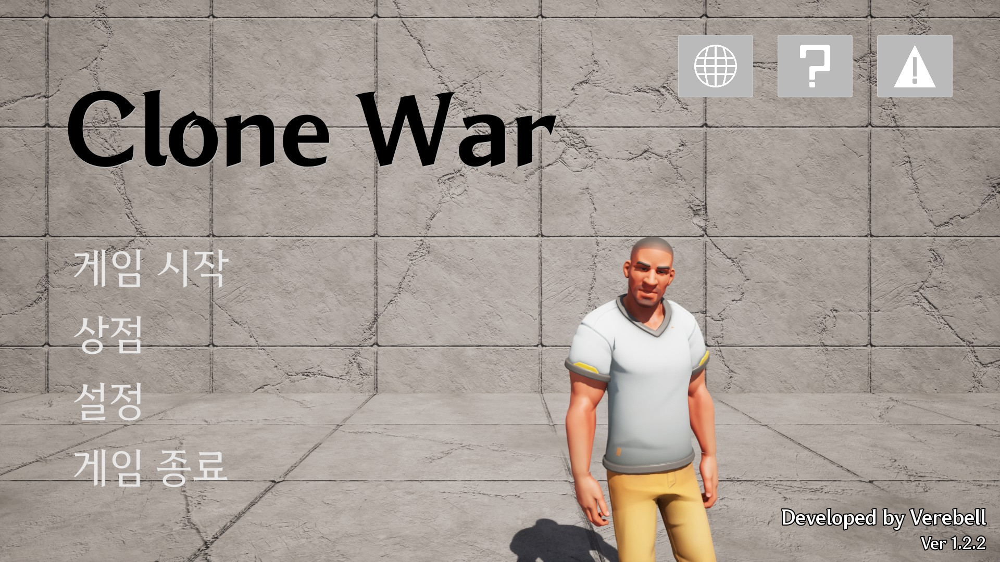
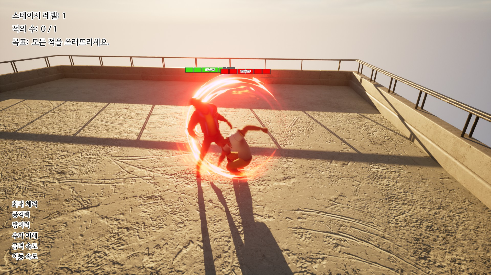
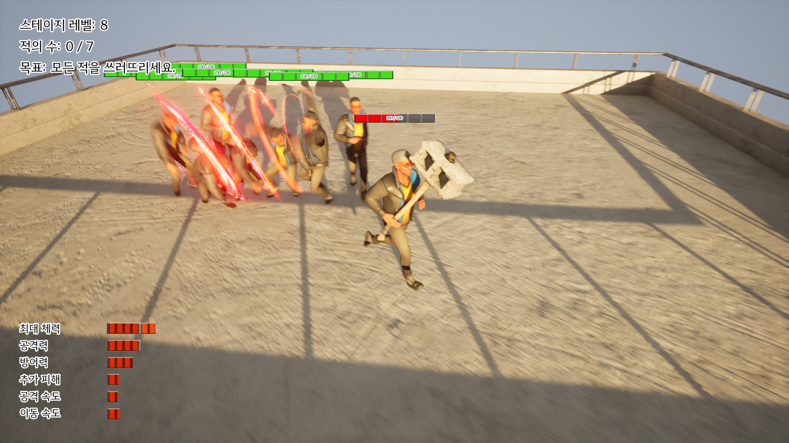
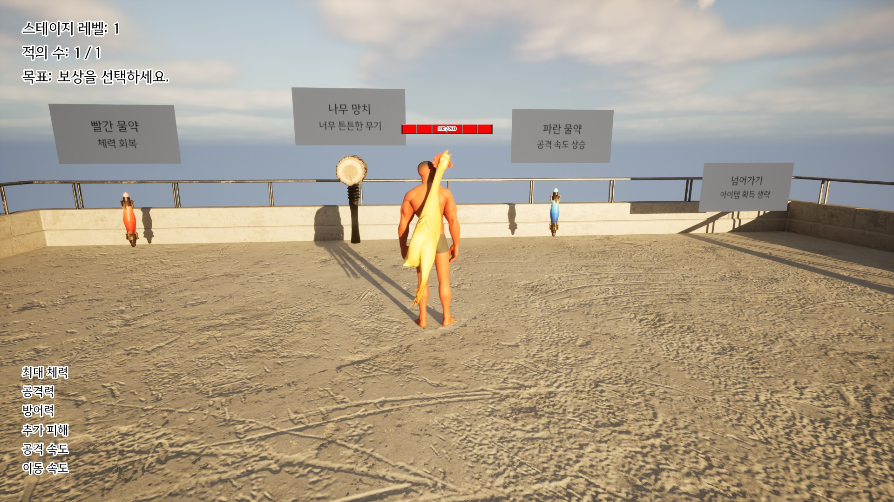
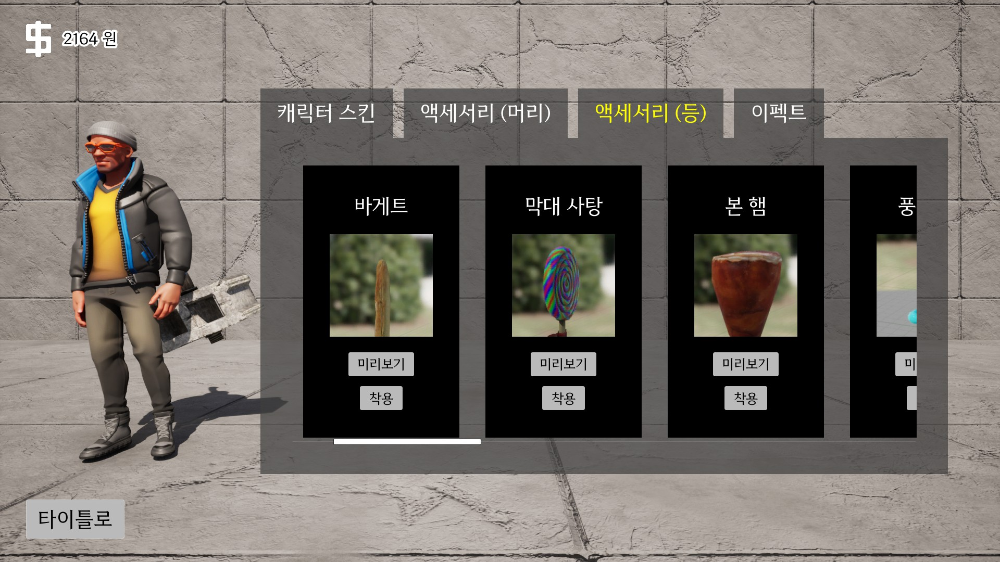

# Clone War

### 프로젝트 소개

언리얼 엔진에 대해 배우기 위해, 1인 개발로 진행한 3D 로그라이크 싱글 플레이 게임 프로젝트입니다.

### 개발 기간

약 6개월

### 개발 환경

C++, Unreal Engine

### 다운로드 링크

[스팀 상점 페이지](https://store.steampowered.com/app/2918600/_/)

### 게임 플레이 영상

[유튜브](https://youtu.be/nhpDWR3qPBQ)

### 게임 주요 스크린샷

